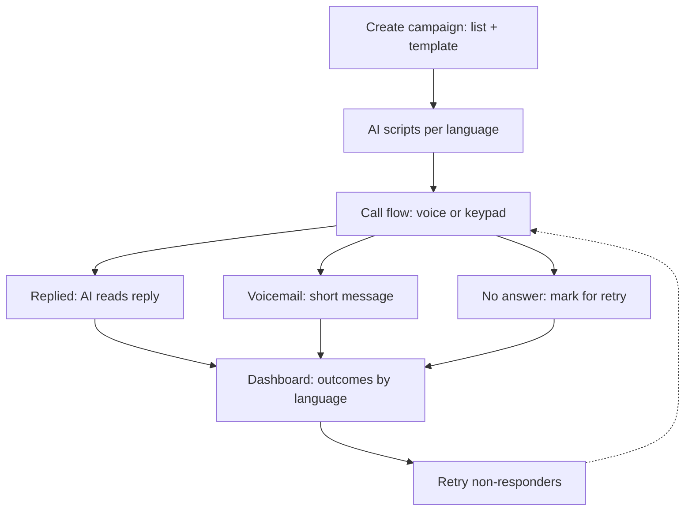

# PROJECT_STATE.md — Swaram

> Source of truth for every coding agent. **Read it fully before coding. Update it before you finish.**
> Last updated: 2026-10-09 · Status: scaffolded · Version: 3

---

## 0. Rules for coding agents

1. Keep it simple. If a task seems to need a new service, queue, or framework, stop and use the existing parts. Anything in §3 "Parked" stays parked.
2. Contracts in §7 are law. Change §7 first, log it in §16, then code.
3. Mock-first: ElevenLabs, telephony and the LLM sit behind small adapters with a mock. Everything runs with `PROVIDER_MODE=mock`.
4. No PII, keys or recordings in code, logs or git. Mask phones in logs and UI by default.
5. Minimal code, no explanatory comments. Typed (mypy / TS strict).
6. ElevenLabs names in this file are from docs search and memory, marked **(verify)**. Check `https://elevenlabs.io/docs/llms.txt` (append `.md` to any docs URL) before coding against them.
7. Stay in your owned directories (§12). Update §13 (tasks) and §16 (changelog) in the same PR.

Status legend: `todo` · `wip` · `blocked` · `review` · `done`

---

## 1. Snapshot

| | |
|---|---|
| Project | **Swaram** (Malayalam: voice) · repo `swaram` |
| One line | Upload contacts, pick a template, calls go out in each person's language, replies are understood, dashboard shows who confirmed, one click retries the rest |
| Event / track | DEFINE 4.0 · PR 002 (Software) |
| Voice | **ElevenLabs** Agents (speech, LLM turn-taking, TTS) over a Twilio number or SIP trunk (Exotel SIP if we get access) |
| Pitch | "One platform, any template, any language, with privacy built in." |

---

## 2. Product flow (4 steps)

1. **Create campaign.** Upload CSV (`name, phone, language, segment?`) and fill a template, e.g. "Workshop on {topic} at {venue} on {date}."
2. **AI writes scripts.** One LLM call turns the template into a natural script per language (ml, hi, en; ta stretch). Operator previews/edits and approves.
3. **Platform calls.** Per person: greet → message → ask → capture answer → confirm → end. Person can **speak or press a key** (1 yes, 2 no).
   - Voicemail → leave short message, mark `voicemail` (retryable).
   - No answer → mark `no_answer` (retryable).
4. **Dashboard.** Confirmed / declined / no answer / voicemail by language and segment. **Retry non-responders** button calls them again.

Reminders and updates reuse the same machinery: **Follow-up** button creates a new campaign from the old one with an audience filter (confirmed / non-responders / all) and a new template ("reminder", "venue changed"). No lifecycle engine.



### What is AI vs plain code

| Part | How |
|---|---|
| Script per language | AI (Claude) |
| Understanding spoken replies | AI (ElevenLabs agent: STT + LLM) |
| Call flow, retries, grouping, consent, call hours, privacy | Plain code |

---

## 3. Scope

**MVP (must demo):** campaign creation + CSV import · script generation with preview/approve · real calls in en/hi/ml via ElevenLabs · speech reply + keypad reply · voicemail + no-answer handling · dashboard by language/segment with retry · two templates (workshop invite, clinic reminder) · privacy basics (§11) · per-language accuracy numbers · mock mode + simulator.

**Stretch (in order):** Follow-up campaign (reminder/update to confirmed) · call detail drawer with transcript and outcome ("agent trace") · payment-reminder template · Tamil · cost/minutes per campaign · browser "call me" fallback · WhatsApp fallback.

**Parked (do NOT build unless the lead moves it up):** Temporal/workflow engine · Redis · MinIO · pgvector/semantic search · RLS/multi-tenant · Presidio · bandit/smart retry timing · waitlist promotion · event versioning/diffing · CRM connectors · live takeover/monitoring · LLM insights panel · contact memory · self-hosted STT/TTS · LiveKit.

---

## 4. Architecture and stack

```
Next.js dashboard ──REST (poll 3s)──> FastAPI ──> SQLite (SQLAlchemy)
                                         │
                         dialer loop (asyncio task in the API process)
                                         │
                                  VoiceProvider adapter
                          ┌──────────────┼───────────────┐
                  ElevenLabsProvider   MockProvider   BrowserProvider (stretch)
                          │
              ElevenLabs Agent ── Twilio number | SIP trunk ── phone
                          │
        during call: POST /voice/tools/record_outcome
        after call:  POST /webhooks/elevenlabs
```

| Layer | Choice |
|---|---|
| Backend | Python 3.12, FastAPI, Pydantic v2, SQLAlchemy 2, httpx, tenacity |
| DB | SQLite file (single container). Swap to Postgres only if concurrency demands |
| Jobs | One asyncio dialer loop + semaphore. No external queue |
| Live updates | Dashboard polls every 3 s |
| Frontend | Next.js 15, TypeScript, Tailwind, shadcn/ui, TanStack Query, Recharts |
| Voice | ElevenLabs Agents + Scribe STT + TTS (`eleven_flash_v2_5` default; `eleven_v3` where a language needs it, likely Malayalam **(verify)**) |
| LLM | Claude via Anthropic API: `claude-sonnet-5-5` for scripts |
| Privacy | `cryptography` Fernet for name/phone, HMAC phone hash, regex redaction |
| Dev/CI | uv, ruff, mypy, pytest, pnpm, Docker Compose (api + web), GitHub Actions |

Language notes **(verify in T-04 bake-off)**: Scribe v2 Realtime lists Hindi, Tamil, Malayalam among 90+ languages; Flash v2.5 lists Hindi and Tamil; Malayalam appears in the Eleven v3 list.

---

## 5. Repo layout

```
swaram/
├── PROJECT_STATE.md  docker-compose.yml  .env.example  .github/workflows/ci.yml
├── apps/
│   ├── api/{Dockerfile,pyproject.toml} app/{main.py,settings.py,db.py,models.py,schemas.py}
│   │        /routers/{campaigns,templates,summary,webhooks,tools}.py
│   │        /services/{scripts,dialer,outcomes,privacy,csv_import}.py
│   │        /providers/{base.py,elevenlabs.py,mock.py}
│   └── web/{Dockerfile,package.json} app/{page.tsx,layout.tsx,globals.css}
├── templates/            # one YAML per template + agent prompt
├── evals/                # lang_eval.py, golden utterances
├── scripts/              # seed_demo.py, simulate.py
└── docs/                 # data-flow.md, pitch.md
```

---

## 6. Data model (SQLite)

| Table | Columns |
|---|---|
| `campaigns` | id, name, template_id, fields(json), languages(json), status(draft/ready/running/done), parent_id?, created_at |
| `scripts` | campaign_id, language, first_message, voicemail_message, key_points, approved |
| `contacts` | id, campaign_id, name_enc, phone_enc, phone_hash, language, segment, opted_out |
| `calls` | id, contact_id, campaign_id, attempt_no, state, outcome, conversation_id, input_mode(speech/keypad), duration_s, transcript_redacted, recording_expires_at, started_at, ended_at |

`calls.state`: `queued → dialing → done | failed`
`calls.outcome`: `confirmed | declined | maybe | callback | optout | no_answer | voicemail | failed`
Non-responders = latest outcome in `{no_answer, voicemail, failed}`. Max attempts per contact: 3 (`MAX_ATTEMPTS`).

---

## 7. Contracts (v1) — change here first

### 7.1 REST

| Endpoint | Purpose |
|---|---|
| `GET /templates` | list templates (id, name, fields, allowed outcomes) |
| `POST /campaigns` (multipart: csv, template_id, fields, languages) | import contacts, generate scripts, status `draft` |
| `GET /campaigns`, `GET /campaigns/{id}` | list / detail with scripts |
| `PATCH /campaigns/{id}/scripts/{lang}` | edit script text |
| `POST /campaigns/{id}/approve` | approve all scripts → `ready` |
| `POST /campaigns/{id}/launch` | queue first attempt per contact → `running` |
| `POST /campaigns/{id}/retry` | queue next attempt for non-responders (respects `MAX_ATTEMPTS`) |
| `POST /campaigns/{id}/followup` `{template_id, fields, audience}` | new campaign cloned from contacts matching `confirmed|declined|non_responders|all` (stretch) |
| `GET /campaigns/{id}/summary` | counts by outcome × language, outcome × segment, totals |
| `GET /campaigns/{id}/calls` | masked list (name initial + `+91•••••1234`, outcome, language, attempt) |
| `GET /calls/{id}` | redacted transcript + outcome + input mode (stretch drawer) |
| `DELETE /campaigns/{id}` | erase contacts, calls, transcripts, recordings |

### 7.2 Voice provider

```python
class VoiceProvider(Protocol):
    async def start_call(self, call: CallRequest) -> str: ...
    async def get_conversation(self, conversation_id: str) -> ConversationRecord: ...
    def verify_webhook(self, headers: Mapping[str, str], body: bytes) -> bool: ...

class CallRequest(BaseModel):
    call_id: UUID
    to_e164: str
    language: str
    first_message: str
    voicemail_message: str
    key_points: str
    dynamic_variables: dict[str, str]
```

`MockProvider` fakes the whole call: waits 1–4 s, picks an outcome by weighted random per language, then invokes the same internal handlers as the real tool/webhook. Used by `scripts/simulate.py` to fill the dashboard.

### 7.3 ElevenLabs integration **(verify each)**

| Need | Mechanism |
|---|---|
| Place call | Outbound call endpoint for Twilio (`/v1/convai/twilio/...`) or SIP trunk `POST /v1/convai/sip-trunk/outbound-call`; optional `telephony_call_config.ringing_timeout_secs` |
| Per-call content | `conversation_initiation_client_data`: `dynamic_variables` + `conversation_config_override` (first_message, language, prompt). Enable overrides in the agent's security settings |
| Capture answer | Server (webhook) tool `record_outcome` |
| Voicemail | Voicemail-detection system tool if available, else prompt rule + end-call tool |
| Keypad | Check whether the agent accepts incoming DTMF on the chosen number type. If not, see risk R2 |
| After call | Post-call webhook (HMAC-verified): transcript, duration, analysis |

One agent total (`swaram-agent`), created by `scripts/` helper or the dashboard, configured per call via overrides. No agent factory.

### 7.4 Tool `record_outcome` (agent → API)

`POST /voice/tools/record_outcome` (header `X-Tool-Secret`)

```json
{"call_id":"uuid","outcome":"confirmed|declined|maybe|callback|optout","input_mode":"speech|keypad","party_size":null,"callback_time":null}
```

Idempotent per `call_id`. `optout` sets `contacts.opted_out`. Response `{ "ok": true }`.

### 7.5 Webhook `POST /webhooks/elevenlabs`

Verify signature → map `conversation_id` to `call` (via `call_id` dynamic variable) → if no outcome yet: `no_answer` / `voicemail` / `failed` from call result → redact and store transcript → set `duration_s`, `ended_at`, `state=done`. Dedupe on `(conversation_id, event type)`.

### 7.6 Template file (`templates/<id>.yaml`)

```yaml
id: workshop_invite
name: Workshop invitation
fields: [topic, venue, date, time, organiser]
question: "Will you attend?"
outcomes: [confirmed, declined, maybe, callback, optout]
keypad: {"1": confirmed, "2": declined}
base_message: "Workshop on {topic} at {venue} on {date} at {time}, organised by {organiser}."
```

Ship `workshop_invite` and `clinic_reminder` (outcomes: confirmed, reschedule→callback, optout). Stretch: `workshop_reminder`, `payment_reminder` (calm tone, state amount and due date once, no pressure).

---

## 8. Voice and dialer

### 8.1 Dialer loop (`services/dialer.py`)
Every 2 s: take `queued` calls from `running` campaigns, only inside calling hours (`CALL_WINDOW`, default 09:00–20:00 IST), skip `opted_out`, run up to `MAX_CONCURRENT` at once, call `provider.start_call`, mark `dialing`. Calls stuck in `dialing` longer than `CALL_TIMEOUT_S` are reconciled via `get_conversation`, else `failed`. Provider/network errors retry with backoff (tenacity), then `failed`.

### 8.2 Why this voice design (pitch)
Scripted facts (date, venue, time) are injected verbatim from the approved script; the agent LLM only interprets replies and answers simple questions from `key_points`. Cheap, no hallucinated details, still conversational. Speech and keypad both accepted; voicemail and no-answer are explicit outcomes and retryable.

### 8.3 Languages
| Lang | Status |
|---|---|
| en, hi | baseline |
| ml | bake-off required (T-04) |
| ta | stretch |

### 8.4 Fallbacks
No phone line at demo → `MockProvider` for dashboards + one pre-recorded real call + browser provider if built. ElevenLabs outage → mock mode toggle (`PROVIDER_MODE=mock`).

---

## 9. AI pieces

### 9.1 Script generator (`services/scripts.py`)
Input: template + filled fields + languages. Output (JSON, schema-validated) per language:
`{"first_message": "...", "voicemail_message": "...", "key_points": "..."}`.
Rules in the prompt: keep all field values verbatim; ≤2 short sentences before the question; polite register; voicemail ≤20 s and includes a callback instruction. Validator rejects output if any field value is missing from `first_message` (fact-preservation). One retry on failure.

### 9.2 Voice agent prompt (`templates/agent_prompt.md`)

```
You are calling {{contact_name}} on behalf of {{organiser}}.
Start in {{language}}; switch if the person answers in another supported language.
Say the first message exactly. Then ask the question and wait.
Accept spoken answers or keypad (1 yes, 2 no). Confirm the answer in one short sentence.
Call record_outcome once with confirmed|declined|maybe|callback|optout, then end the call.
Answer simple questions only from KEY_POINTS: {{key_points}}. Otherwise say the organiser will follow up and record callback.
If voicemail is detected, say {{voicemail_message}} and end the call.
If they ask not to be called, apologise, record optout, end.
Never invent details, never pressure, never read out numbers or IDs.
```

### 9.3 Accuracy numbers (required for demo)
`evals/lang_eval.py`: 10–15 spoken test phrases per language (yes, no, maybe, "call me later", code-mixed examples) played through the agent path or Scribe; report intent accuracy per language and note latency. Put the table on the pitch slide and in §16.

---

## 10. Dashboard

Pages: `/campaigns` list · `/campaigns/new` (upload → template → fields → script preview/edit → approve → launch) · `/campaigns/[id]`.
Campaign page: totals cards (confirmed / declined / no answer / voicemail), stacked bar by language, table by segment, calls table (masked), **Retry non-responders** button, status badge, stretch: call drawer, Follow-up button.
Clean and polished matters (judges see this first). Loading skeletons, empty states, responsive.

---

## 11. Privacy (required by the brief)

| Control | Implementation |
|---|---|
| Encrypt contact lists | Fernet on `name_enc`, `phone_enc`; HMAC `phone_hash` for dedupe |
| Mask numbers | UI/API/logs show `+91•••••1234`; no raw phones in logs |
| Redact transcripts | Regex mask for phone-like digit runs and emails before storing |
| Auto-delete recordings/transcripts | Daily purge job and on startup: delete where `recording_expires_at < now`; defaults `RETENTION_DAYS=30` |
| Consent | `opted_out` honoured before every dial; recording notice in the opening line; calling-hours window |
| Erase | `DELETE /campaigns/{id}` |
| Data-flow slide (`docs/data-flow.md`) | Where voice, language and data processing happen |

**Honest data flow (use exactly this):** call audio and live conversation text are processed by ElevenLabs (speech recognition, LLM, speech synthesis) and the telephony provider; we check and state the data-residency / zero-retention settings of our plan. Contacts, transcripts and recordings are stored on our own server, encrypted. Script generation sends only template text and field values (no contact data) to Claude. Do **not** claim audio stays on our infrastructure. Future work: self-hosted speech stack.

---

## 12. Build agents

| Agent | Owns | Tasks |
|---|---|---|
| `lead` | this file, contracts, merges, demo script | T-01, T-13, T-15 |
| `backend` | `apps/api`, `templates/` | T-02, T-03, T-05, T-06, T-07, T-09 |
| `voice` | `apps/api/app/providers`, `templates/agent_prompt.md`, `evals/` | T-04, T-08 |
| `frontend` | `apps/web` | T-10, T-11, T-12 |
| `qa` | `scripts/`, tests, `docs/` | T-13, T-14, T-15 |

Pattern: lead slices tasks → specialists work in parallel on disjoint folders → qa checks → lead merges. One task = one branch `<agent>/T-xx-slug` = one PR.

Handoff note (PR description): `Task · From→To · Delivered · Contract touched · How to verify · Open issues`.

**Definition of done:** runs in mock mode · mypy/tsc/ruff clean · tests added · no PII/secrets in logs · `.env.example` updated · §7 updated if a contract changed · §13 and §16 updated.

---

## 13. Task board

| ID | Task | Owner | Deps | Status |
|---|---|---|---|---|
| T-01 | Scaffold repo, compose (api+web), `.env.example`, CI | lead | — | done |
| T-02 | Models, SQLite, privacy service (encrypt, mask, redact, purge) | backend | T-01 | todo |
| T-03 | Templates loader + CSV import (validate E.164, dedupe, encrypt) | backend | T-02 | todo |
| T-04 | Language bake-off (en/hi/ml/ta): TTS model, voice, latency, accuracy | voice | ElevenLabs key | todo |
| T-05 | Script generator + validator + `POST /campaigns`, edit, approve | backend | T-03 | todo |
| T-06 | `VoiceProvider` base + `MockProvider` + simulator | backend | T-02 | todo |
| T-07 | Dialer loop (hours, concurrency, opt-out, timeout reconcile) + launch/retry | backend | T-06 | todo |
| T-08 | `ElevenLabsProvider`: agent config, outbound call, overrides, webhook verify, tool endpoint | voice | T-04, T-06, number | todo |
| T-09 | Summary/calls endpoints | backend | T-07 | todo |
| T-10 | App shell + campaign list + create wizard | frontend | T-01 | todo |
| T-11 | Campaign page: cards, language chart, segment table, retry | frontend | T-09 | todo |
| T-12 | Script preview/edit UI | frontend | T-05 | todo |
| T-13 | `docs/data-flow.md` + privacy slide | lead | T-02 | todo |
| T-14 | Accuracy table per language (`evals/lang_eval.py`) | qa | T-08 | todo |
| T-15 | Demo rehearsal, seed data, recorded backup call | qa | T-11 | todo |
| S-01 | Follow-up campaign (reminder/update to confirmed) | backend+frontend | T-09 | todo |
| S-02 | Call detail drawer (transcript + outcome) | frontend | T-09 | todo |
| S-03 | Payment-reminder template, Tamil, cost/minutes | backend | T-08 | todo |

Critical path: T-01 → T-02 → T-06 → T-07 → T-09 → T-11 → T-15. Start T-04 as soon as a key exists.
Cut order if late: S-03 → S-02 → S-01 → Tamil. Never cut: real call demo, outcome capture, voicemail/no-answer + retry, dashboard by language, privacy slide.

---

## 14. Env and commands

| Var | Purpose |
|---|---|
| `PROVIDER_MODE` | `mock` \| `elevenlabs` |
| `DATABASE_URL` | default `sqlite:///./swaram.db` |
| `FERNET_KEY`, `HMAC_PHONE_KEY` | encryption + phone hash |
| `ELEVENLABS_API_KEY`, `ELEVENLABS_AGENT_ID`, `ELEVENLABS_PHONE_NUMBER_ID` | voice |
| `ELEVENLABS_WEBHOOK_SECRET`, `TOOL_SECRET` | webhook + tool auth |
| `TELEPHONY_KIND` | `twilio` \| `sip` |
| `ANTHROPIC_API_KEY` | scripts |
| `PUBLIC_BASE_URL` | webhook/tool base (tunnel in dev) |
| `MAX_CONCURRENT`, `MAX_ATTEMPTS`, `CALL_TIMEOUT_S`, `CALL_WINDOW`, `RETENTION_DAYS` | behaviour |

```bash
docker compose up -d
uv run pytest -q && uv run ruff check . && uv run mypy apps
pnpm --filter web dev
python -m scripts.seed_demo
python -m scripts.simulate --campaign <id> --n 200
python -m evals.lang_eval --langs en,hi,ml
cloudflared tunnel --url http://localhost:8000
```

---

## 15. Demo (3–4 min) and acceptance

1. Create workshop campaign; show scripts in ml/hi/en.
2. One real call (or simulated if telephony isn't ready): reply by voice, then by keypad.
3. Dashboard by language/segment.
4. Click retry non-responders.
5. Swap to the clinic-reminder template to show reuse. (Stretch: Follow-up reminder to confirmed.)
6. Privacy slide: where voice, language and data processing happen.

Acceptance: mock run of 200 calls fills dashboard; ≥1 real call each in en/hi/ml; accuracy table per language ready; no phone numbers in logs (grep test).

---

## 16. Decisions, risks, questions, changelog

**Decisions**
| ID | Entry |
|---|---|
| D1 | ElevenLabs Agents = voice runtime (STT + LLM + TTS + turn-taking) |
| D2 | Campaign (not event lifecycle) is the core object; reminders/updates = Follow-up campaigns |
| D3 | SQLite + asyncio dialer + polling. No Temporal, Redis, MinIO, pgvector, RLS, Presidio |
| D4 | One ElevenLabs agent, per-call overrides + dynamic variables |
| D5 | Scripts generated once per language, human-approved, facts verbatim |
| D6 | Outcome captured by `record_outcome` tool; webhook is the safety net |
| D7 | Honest data-flow statement (§11); no "audio stays local" claim |
| D8 | Name: Swaram |

**Risks**
| ID | Risk | Mitigation |
|---|---|---|
| R1 | No phone number/telephony by demo | Mock + recorded real call + browser provider |
| R2 | ElevenLabs can't take keypad input on our number type | Add a ~100-line Twilio `<Gather input="speech dtmf">` provider for keypad-only calls, or demo keypad in mock and say so |
| R3 | Malayalam quality | Bake-off first; use v3 for ml; fall back to hi/en for the live demo |
| R4 | Credit burn | Mock default, short test scripts, `MAX_CONCURRENT` low in dev |
| R5 | Webhook delivery flaky | Reconcile stuck calls via `get_conversation` |
| R6 | Scope creep | §3 Parked list; lead gatekeeps |

**Open questions:** Exotel SIP trunk available? Plan includes data residency/zero retention? DTMF behaviour on our number? Voicemail-detection tool available? Which demo numbers are verified/consented? Team roster for agent roles?

**Changelog**
| Date | Agent | Change |
|---|---|---|
| 2026-10-09 | lead | v1 created (event-lifecycle design) |
| 2026-10-09 | lead | v2: merged team's simple flow, campaign-centric, removed Temporal/Redis/MinIO/pgvector/RLS/Presidio/bandit/lifecycle, added Parked list, cut roster and tasks |
| 2026-10-09 | lead | v3: added the API and dashboard scaffold, Compose, env example, CI, and local setup docs; T-01 complete |
