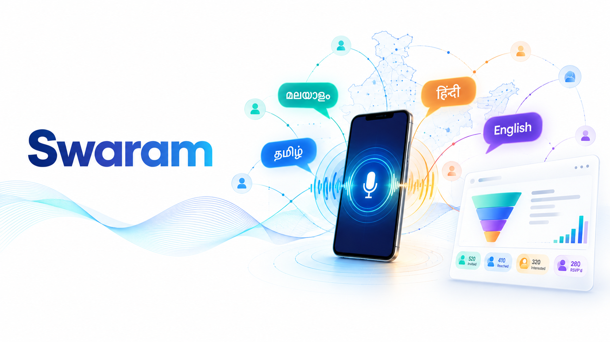
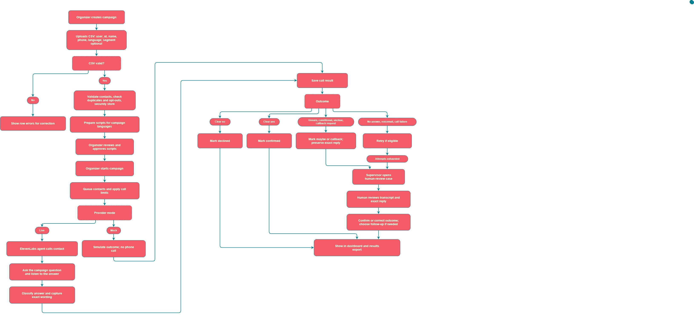

# DEFINE 4.0

The official project submission repository for **DEFINE 4.0 — The World's Realest Hackathon**.

---
# Swaram

<!-- Add your project cover image below -->



## Team Information

- **Team Name**: Sector 21
- **Track**: PR 002 (Software)

## Team Members

| Name | Role | GitHub | LinkedIn |
|------|------|--------|----------|
| Rithun K P | AI/ML, Voice Pipeline | [@username](https://github.com/rithunkp) | [Profile](https://linkedin.com/in/rithun-kp) |
| Ajmal M | Role | [@username](https://github.com/24f2004489) | [Profile](https://linkedin.com/in/username) |
| Muhammad Shifas | Role | [@username](https://github.com/msnk-dev) | [Profile](https://linkedin.com/in/username) |
| Hareesh V | Role | [@username](https://github.com/hv2337) | [Profile](https://linkedin.com/in/username) |

---

# Project Details

## Overview

Swaram lets an organiser upload a contact list, pick a template, and phone everyone in the language they speak. It understands each reply, shows who confirmed, and retries the rest with one click. The same flow works for clinic reminders, school notices and payment follow-ups.

## Problem Statement

Institutions run seminars and workshops across cities, and most still chase attendance with phone calls, spreadsheets and mass messages.

- **What is the problem?** Calling hundreds or thousands of people in their own language, noting who is coming, and telling them when plans change takes a lot of time and money, and mistakes creep in.
- **Who is affected?** Organisers, clinics, schools and finance teams, along with the people on the other end who get calls in the wrong language or at the wrong time.
- **Why does it matter?** Every missed update or unreachable contact is an empty seat or a skipped appointment. Contact lists and call recordings are also personal data, and they often get handled carelessly.
- **Limits of existing solutions:** IVR blasts speak one language and can't listen. Call centres don't scale. Most tools only track whether a call was made, not whether the person is coming, so a venue change means redoing the campaign by hand.

## Solution

Swaram turns an **event** into a campaign. The organiser uploads contacts and picks a template, an AI step writes the script in each language (Malayalam, Hindi and English to start), and the organiser reviews and approves it. A voice agent then calls everyone: facts like the date and venue are read exactly as approved, and the AI only works out what the person says back. People can speak their answer or press a key, and voicemail and no-answer are logged as outcomes that can be retried. The dashboard shows confirmed, declined, no-answer and voicemail by language and segment, with one-click retry for non-responders. Reminders and updates go out the same way, as follow-up campaigns to the people who confirmed. Contact data is encrypted and masked, transcripts are redacted, and recordings are deleted automatically. Call audio is handled by our voice provider, ElevenLabs, and everything we store stays on our own server.

---

# Demo

### Demo Video

[Watch Project Demo](https://www.youtube.com/watch?v=VIDEO_ID)

> Replace `VIDEO_ID` with your YouTube video ID.

### Screenshots

<!-- Add screenshots of your project here -->


---

# Live Project

[Visit Live Project](https://your-project-url.com/)

---

# Technical Implementation

## Technologies Used

| Category | Technologies |
|----------|--------------|
| **Frontend** | Technologies |
| **Backend** | Technologies |
| **Database** | Technologies |
| **APIs / Services** | Technologies |
| **AI / ML** | Technologies |
| **DevOps / Deployment** | Technologies |
| **Other Tools** | Technologies |

## System Architecture

<!-- Add your architecture diagram here -->



## Key Features

- Feature 1
- Feature 2
- Feature 3
- Feature 4
- Feature 5

---

# Setup Instructions

## Prerequisites

Make sure the following are installed before running the project:

- Requirement 1
- Requirement 2
- Requirement 3

## Installation

### 1. Clone the Repository

```bash
git clone <repository-url>
